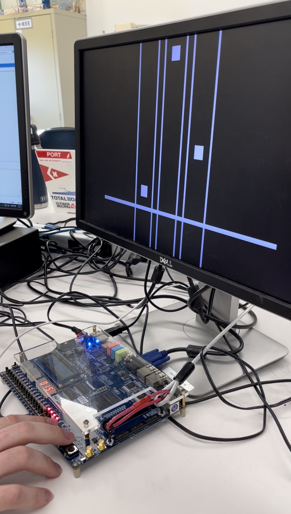

# ECE287-Final-Project
Piano Tile game on DE2-112

## Overview
This repository contains the Verilog code for a Piano Tile game implemented on an FPGA board. The game involves notes falling from the top of the screen, and the player scores points by pressing a button, and the note aligns with a horizontal line at the bottom.

## Problem Description
The goal of this project is to create an interactive game on an FPGA board using Verilog. The game features falling notes, user input from buttons, and a scoring mechanism, along with a complex FSM with multiple states. Note that there is a known issue with the scoring mechanism, where the imperfect input of the button can lead to multiple score increments for each tick (50MHz) the button is held down.

## Background Information
Understanding the Verilog code is essential for anyone intending to use or extend this project. The project includes modules for VGA display, game control, scoring, and synchronization with user input. The game's state machine transitions through drawing, playing, erasing, and updating phases.

## Design Description
The main Verilog modules include:
`final_project_main`: Top-level module integrating display, control, and scoring.
`final_project_vga_controller`: VGA controller generating necessary signals for display, with credit to _______________ for the VGA display code.
`final_project_points`: Module handling scoring logic based on user input and note positions.
`final_project_main_control`: Control module managing the game's state transitions.
`final_project_seven_seg`: Module for displaying the score on a seven-segment display.
`final_project_display`: Module combining VGA display, scoring, and control.

The scoring mechanism has a known issue where multiple score increments can occur if the button is held down for more than 1 tick (50MHz).

## Results
The game successfully runs on the FPGA board, providing an interactive experience for the player. The VGA display accurately renders falling notes, and the scoring system responds to timely button presses.

## Conclusion
Despite the known issue with the scoring mechanism, the project demonstrates the implementation of a falling notes game using Verilog on an FPGA. The modular design allows for easy understanding and potential extensions. Further improvements could address the scoring issue and enhance the game dynamics.

## Media

*Caption: A screenshot demonstrating the gameplay of the falling notes game.*

**Demo Video**: https://youtube.com/shorts/JPL5mak56ks?feature=shared

## Citations
The project utilizes standard Verilog constructs and FPGA board-specific modules. Credit goes to ___________ for the VGA display code, which greatly contributed to the project.

For any specific code credits or external references, provide links to the relevant sources in this section.

Feel free to contact the project contributors for any questions or collaboration opportunities.

